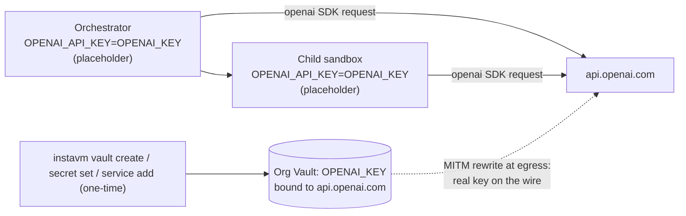

# InstaVM Cookbooks

A public catalog of apps and experiences you can deploy with `instavm cookbook deploy`.

Each cookbook lives at the repo root:

- `/<slug>/instavm.yaml`
- `/<slug>/Dockerfile`
- `/<slug>/...app files...`

## Local Validation

```bash
python3 scripts/validate_manifests.py
```

## Included Apps

- `hello-fastapi`: a simple FastAPI app with a hello page and health endpoint.
- `neon-city-webgl`: immersive fullscreen WebGL cityscape with procedural towers and a looping robot pedestrian.
- `claude-simple-chatapp`: browser chat for Claude with a React frontend and live conversation threads.
- `openai-agents-js-chat`: streaming browser chat with tool calls, reasoning, and support handoffs.
- `openai-agents-python-research`: newspaper-style deep research desk. The agent searches and reads the public web through a Chromium browser running on InstaVM and files a cited memo; the OpenAI key never enters the deployed VM (consumed from the org vault).
- `openai-agents-python-injection-scanner`: streaming prompt-injection scanner; runs adversarial tooling against an uploaded document inside a fresh, egress-locked InstaVM child sandbox. *First cookbook to use InstaVM as the OpenAI Agents SDK sandbox provider.*
- `openai-agents-python-vibe-preview`: describe a small web app, watch the agent build it inside a fresh InstaVM microVM, and click a live TLS preview URL backed by an InstaVM share.
- `openai-agents-python-vault-demo`: OpenAI Agents SDK on InstaVM with **no real OpenAI key in the orchestrator or in the sandbox**. The cookbook holds only `INSTAVM_API_KEY`; `OPENAI_API_KEY` is a literal placeholder string and the org-scoped InstaVM Vault rewrites it to the real value at TLS write time.
- `vscode-microvm`: VS Code in the browser via `coder/code-server` (Apache-2.0), running inside a Firecracker microVM. Edit code in the browser; everything executes in a real KVM VM with the same isolation, secrets, and audit posture as any other InstaVM workload.
- `google-adk-web-chat`: travel-focused city guide chat for itineraries, neighborhoods, and timing advice.
- `dspy-hosted-chat`: structured DSPy chat that replies with a concise answer and a sharp follow-up question.

## Sandbox-provider cookbooks

`openai-agents-python-injection-scanner` and `openai-agents-python-vibe-preview` are different from every other cookbook in this repo: instead of running the agent loop in the deployed VM and calling OpenAI directly, the deployed FastAPI app uses InstaVM as the OpenAI Agents SDK *sandbox provider*. Every request spawns a fresh, disposable child microVM via `InstaVMSandboxClient` where the agent's shell and file tools run.

```
Browser -> Outer cookbook VM (orchestrator)
              |  holds OPENAI_API_KEY + INSTAVM_API_KEY
              v
           InstaVM control plane
              |
              v
           Fresh disposable child microVM
              - workspace seeded from Manifest
              - egress: package mirrors only
              - no API keys
              - dies at end of run (or after preview TTL)
```

### Security model

- The Agents SDK runs the model **in the orchestrator process**. The child sandbox executes tool calls (shell, files, optional ports) but never sees `OPENAI_API_KEY` or `INSTAVM_API_KEY`.
- Egress in the child sandbox is locked: `allow_internet_access=False`, `allow_http=False`, `allow_https=False`, `allow_package_managers=True`. The agent inside can install packages from PyPI/apt mirrors but cannot reach attacker-controlled URLs.
- A successful prompt injection from a hostile document has nowhere to exfiltrate to: no keys, no internet egress, disposable VM.

### Vault adoption: `openai-agents-python-vault-demo`

`openai-agents-python-vault-demo` is the inverse pattern. The cookbook holds **no** real `OPENAI_API_KEY` anywhere; the orchestrator and the child sandbox both call `api.openai.com` using a literal placeholder string (default: `OPENAI_KEY`). The org-scoped InstaVM Vault — set up once via four CLI commands — substitutes the real credential on the wire at TLS write time.



Vault is **organization-scoped** — every VM your org launches inherits the bindings. The cookbook never calls a vault API; it only consumes what the user has already set up via CLI. See [openai-agents-python-vault-demo/README.md](openai-agents-python-vault-demo/README.md) for the four commands and a falsifiability check (`echo $OPENAI_API_KEY` inside the cookbook VM should print the placeholder).

## One-time vault setup (covers every cookbook)

Every cookbook that talks to a hosted LLM (`openai-agents-*`, `claude-simple-chatapp`, `dspy-hosted-chat`, `google-adk-web-chat`, …) reads its credentials from the same org-scoped InstaVM Vault. Real keys never enter the cookbook's VM: the orchestrator sees a literal placeholder string, and the platform's egress MITM proxy swaps it for the real value at TLS write time. Set this up **once** per org, then `instavm deploy` any cookbook without pasting credentials into a deploy form.

> Requires `instavm` CLI ≥ 0.23.0 for the interactive bootstrap (`instavm vault setup` and `instavm deploy` self-bootstrap). 0.22.0 supports `vault.hosts` auto-binding without the bootstrap; older CLIs ignore the field.

### Easiest path (since 0.23.0): let `instavm deploy` walk you through it

`instavm.yaml` declares `vault.required: true` for every LLM cookbook in this repo, so `instavm deploy` will scan your org for a matching vault, and if none is bound, offer to create + populate one on the spot. The first time you deploy a vault-aware cookbook, the prompts look like this:

```text
$ cd openai-agents-python-research && instavm deploy .
…
  Scanning org vaults for api.openai.com
  No vault covers: api.openai.com — entering interactive setup
  • api.openai.com → ${OPENAI_API_KEY} (will use catalog template 'openai')
Bootstrap a vault now and walk through 1 secret(s)? [Y/n] y
No org vault matches the cookbook's hosts. Create a new vault named 'openai-agents-python-research-vault' now? [Y/n] y
  Creating vault openai-agents-python-research-vault
  Value for OpenAI (OPENAI_API_KEY): ********              ← getpass; not echoed, not in history
  Stored OPENAI_API_KEY (value not echoed)
  Bound template 'openai' → openai-agents-python-research-vault
  Vault vlt_… ready
  …continues with the actual deploy
```

The bootstrap is **idempotent** and **org-scoped**: re-deploying the same (or any other) vault-aware cookbook reuses the existing binding instead of prompting again. If you need to extend the same vault for a second provider (e.g. add Anthropic later), just `cd` into a cookbook that needs it and run `instavm deploy` — the CLI extends the existing vault rather than creating a new one.

Want to provision the vault without spinning up a VM (e.g. in CI before non-interactive deploys)? Run the same flow standalone:

```bash
instavm vault setup ./openai-agents-python-research
# → "already_covered" if the vault is wired up
# → walks you through the prompts otherwise
```

Pass `--no-setup-vault` to `instavm deploy` to skip the prompt (useful for CI where no human is at the terminal); the deploy will then fail fast with the manual recipe below.

### Manual setup (CI-friendly, or for CLIs older than 0.23.0)

```bash
# 1. Create an org vault. Pick any name; cookbooks scan all org vaults.
VAULT_ID=$(instavm vault create cookbook-org -j \
  | python3 -c "import sys,json; print(json.load(sys.stdin)['id'])")

# 2. For each LLM you use, add a credential under the *catalog credential key*
#    (`OPENAI_API_KEY`, `ANTHROPIC_API_KEY`, `OPENROUTER_API_KEY`,
#    `GOOGLE_API_KEY`), then bind it to the upstream host. The CLI prompts for
#    the value via getpass so it never enters your shell history.

# OpenAI (used by openai-agents-python-research, openai-agents-python-vault-demo,
#         openai-agents-python-vibe-preview, openai-agents-python-injection-scanner,
#         openai-agents-js-chat)
instavm vault secret set  "$VAULT_ID" OPENAI_API_KEY
instavm vault service add "$VAULT_ID" --template openai

# Anthropic (used by claude-simple-chatapp).
instavm vault secret set  "$VAULT_ID" ANTHROPIC_API_KEY
instavm vault service add "$VAULT_ID" --template anthropic

# OpenRouter (used by dspy-hosted-chat). Custom host, bearer auth.
instavm vault secret set  "$VAULT_ID" OPENROUTER_API_KEY
instavm vault service add "$VAULT_ID" --host openrouter.ai \
  --auth-type bearer --credential OPENROUTER_API_KEY

# Google Gemini (used by google-adk-web-chat). Custom host, x-goog-api-key header.
instavm vault secret set  "$VAULT_ID" GOOGLE_API_KEY
instavm vault service add "$VAULT_ID" --host generativelanguage.googleapis.com \
  --auth-type header --header x-goog-api-key --credential GOOGLE_API_KEY

# 3. Verify (returns names + bound hosts; never returns secret values).
instavm vault discover "$VAULT_ID"
```

After this, deploy any vault-aware cookbook with **only** the cookbook-specific secrets (e.g. `INSTAVM_API_KEY`) — no `OPENAI_API_KEY` / `ANTHROPIC_API_KEY` / etc. ever appear in the VM:

```bash
cd openai-agents-python-research
instavm deploy .
# CLI prompts for INSTAVM_API_KEY only; OpenAI calls hit the bound vault
# transparently, and the deploy plan shows: "Binding api.openai.com via vault vlt_…".
```

Pass `--vault VAULT_ID` to override auto-discovery (useful if you have multiple org vaults), or `--no-vault` to disable vault binding entirely. Cookbooks that use the vault pattern declare `vault.required: true` in their `instavm.yaml`; deploy fails fast (or, on 0.23.0+, offers to bootstrap) when no matching vault is bound.

## Making existing cookbooks more interesting

Each idea below preserves the standard cookbook contract (no manifest changes), so `instavm cookbook deploy <slug>` and `instavm deploy <local-path>` keep working. The user just supplies an extra `INSTAVM_API_KEY` secret and the chat gains a sandboxed tool call.

- `claude-simple-chatapp`: add a `run_python` tool that materializes the snippet into a Manifest entry and executes it in a per-message InstaVM sandbox; render stdout/stderr/charts inline. Same UI, much more powerful.
- `openai-agents-js-chat`: add a `Run code` button next to assistant messages that contain code blocks; spin up a JS-Agents-SDK sandbox via the InstaVM provider and stream the result.
- `dspy-hosted-chat`: add a self-grader pass that runs the previous answer through a sandbox-executed Python evaluator (e.g., property-based tests) and reports pass/fail before showing the answer.
- `google-adk-web-chat`: add an itinerary validator tool that runs a small Python checker (open hours / transit time feasibility) in a sandbox.
- `openai-agents-python-research`: add an optional `verify_with_code` step that materializes any computed claim into a sandboxed Python check before including it in the briefing.

## Deploy Contract

`instavm.yaml` drives deploy behavior for both `instavm cookbook deploy` and the future `instavm deploy`.

Required top-level keys:

- `schema_version`
- `slug`
- `title`
- `version`
- `summary`
- `category`
- `runtime`
- `deploy`
- `vm`
- `app`
- `run`
- `secrets`
- `post_deploy_notes`

`deploy.kind` supports:

- `published_snapshot`
- `upload_and_run`

Runtime secrets are injected as environment variables at deploy time. They are not stored in this repo.

## Publishing

First-party cookbook images publish to Docker Hub, and the corresponding public system snapshots use deterministic names like `cookbook/<slug>:<version>`.
