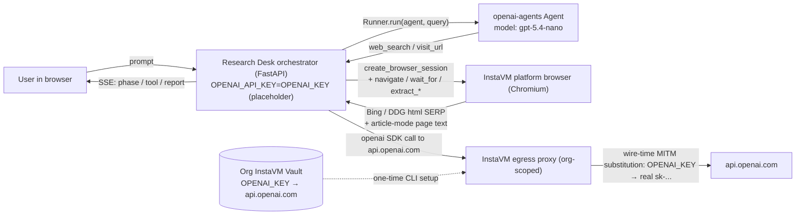

# The Research Desk

A newspaper-style deep-research assistant. Drop in a question, watch the
agent search the public web and read the most promising results live, and
read the filed memo with inline citations.

## What's different about this cookbook

| Concern | Other research apps | The Research Desk |
| --- | --- | --- |
| Web access | Hosted `WebSearchTool()` — opaque, no audit. | InstaVM platform browser (Chromium). Every search and page fetch is yours, audited, and shown live. |
| OpenAI key | Pasted into a deploy form, lives in the VM env. | Never enters the VM. The org InstaVM vault holds the real value; the egress proxy substitutes it on the wire. |
| Progress | A spinner. | A live "Editor's Notebook" panel — every search query and every URL the agent reads is logged in real time. |
| UI | Generic dashboard. | Newspaper aesthetic: serif type, cream paper, ruled rules, "Filed Report" + "Editor's Notebook" columns. |

## Architecture



The agent runs an iterative loop: search → pick promising URLs → fetch and
read each → synthesize. Hard caps on `RESEARCH_MAX_TURNS` (16) and
`RESEARCH_MAX_VISITS` (8) keep wall-clock and cost bounded.

## Setup

This cookbook is vault-only — it accepts **just one** secret at deploy
time, `INSTAVM_API_KEY`. The OpenAI key lives in your org's InstaVM vault
and is never present in the cookbook's VM.

If you've never set up the org vault before, run these four commands once
on your own machine. Every InstaVM cookbook that needs OpenAI will pick
them up automatically, no per-cookbook key entry:

```bash
# 1. Create an org vault.
VAULT_ID=$(instavm vault create cookbook-org -j \
  | python3 -c "import sys,json; print(json.load(sys.stdin)['id'])")

# 2. Add the OpenAI key under the placeholder name OPENAI_KEY.
instavm vault secret set "$VAULT_ID" OPENAI_KEY   # prompts for value

# 3. Bind that credential to api.openai.com so the egress proxy knows
#    where to substitute it.
instavm vault service add "$VAULT_ID" \
  --host api.openai.com --auth-type bearer --credential OPENAI_KEY

# 4. Verify
instavm vault discover "$VAULT_ID"
```

If you skip the setup, the cookbook still deploys, but the homepage shows a
"Vault not configured" banner with these exact commands and `/api/report`
returns 503 until the binding exists.

## Deploying

```bash
cd cookbooks/openai-agents-python-research
instavm deploy .
# CLI prompts for INSTAVM_API_KEY only.
```

Open the share URL printed at the end. Type a research question (or pick a
chip), press **File the report**, and watch the Editor's Notebook fill in
as the agent searches and reads.

## How `web_search` and `visit_url` actually work

`web_search(query, max_results)`:

1. Reuse (or create) a per-request InstaVM browser session.
2. Navigate to `https://www.bing.com/search?q=<query>`. Wait for
   `li.b_algo cite` to render (Bing's headless-friendly stable selector).
3. Extract titles (`li.b_algo h2`), URLs (`li.b_algo cite`), snippets
   (`li.b_algo .b_caption p`). Return the top N rows.
4. If Bing returned nothing, fall back to DuckDuckGo HTML
   (`https://duckduckgo.com/html/?q=<query>`) with selectors `a.result__a`
   and `a.result__snippet`.

`visit_url(url)`:

1. Reuse the session, navigate to the URL.
2. Call `browser_extract_content(...)` — InstaVM's article-mode extractor —
   to pull clean readable text without JS, CSS, ads, navigation.
3. Cap to `RESEARCH_PAGE_CHARS` characters before returning to the agent.

There is no in-orchestrator HTTP fallback (e.g. `httpx`/`ddgs`). The
cookbook VM has restricted egress by default; only the InstaVM browser
(running on platform infrastructure) can reach the public web reliably.

## Tunables (env vars at deploy time)

| Variable | Default | Notes |
| --- | --- | --- |
| `OPENAI_MODEL` | `gpt-5.4-nano` | Any model your org has access to. |
| `RESEARCH_MAX_TURNS` | `16` | Hard ceiling on agent turns per request. |
| `RESEARCH_MAX_VISITS` | `8` | How many distinct URLs the agent may read per request. |
| `RESEARCH_SEARCH_RESULTS` | `6` | Default `max_results` for `web_search`. |
| `RESEARCH_PAGE_CHARS` | `12000` | Per-page character budget fed back to the agent. |
| `RESEARCH_BROWSER_TIMEOUT_MS` | `25000` | Per-navigation timeout. |
| `RESEARCH_BROWSER_WAIT_MS` | `8000` | Wait-for-selector budget after navigation. |
| `RESEARCH_TIMEOUT_S` | `240` | End-to-end request timeout. |
| `VAULT_DEMO_PLACEHOLDER` | `OPENAI_KEY` | Placeholder name the orchestrator sets; must match the credential name in the vault. |
| `VAULT_DEMO_HOST` | `api.openai.com` | Vault binding hostname checked at preflight. |

## Falsifiability check: the OpenAI key really isn't in this VM

After deploy, SSH in and inspect:

```bash
instavm connect <vmid>
echo $OPENAI_API_KEY     # → OPENAI_KEY  (the placeholder)
env | grep -i openai     # only OPENAI_API_KEY=OPENAI_KEY appears
```

If the egress proxy stops substituting (vault binding deleted, network
issue), every model call gets a 401 immediately. The cookbook then can't
mask the failure: the UI surfaces the 401 and the timeline shows it.

## What the briefing always looks like

The agent is constrained to write the same five sections, in this order:

- **TL;DR** (2-3 bullets)
- **Key Findings** (5-8 bullets, each citing a `(source: https://...)`)
- **Risks & Counterpoints**
- **Open Questions**
- **Sources** — every URL the agent actually visited, one-line summary each.

Cited URLs must have appeared in a tool result; the model isn't allowed to
invent sources.
