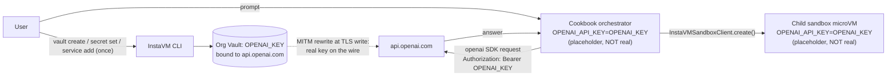

# openai-agents-python-vault-demo

OpenAI Agents SDK on InstaVM **without ever holding a real OpenAI key in this cookbook**.

The orchestrator's `OPENAI_API_KEY` is set to a literal placeholder string (`OPENAI_KEY` by default). The OpenAI SDK in the orchestrator and inside the child sandbox both happily read that placeholder and send HTTPS requests to `api.openai.com`. InstaVM's organization-scoped **Vault** intercepts the request at the egress proxy and substitutes the real token at TLS write time. The wire carries the real key; no process anywhere in this cookbook ever does.

## Architecture



Both the orchestrator and the child sandbox sit on the InstaVM platform, so both inherit the org's vault bindings. The cookbook itself does not call any vault API; it just relies on the bindings the user creates with the CLI.

## One-time setup (CLI)

You only need to do this once per InstaVM organization. The cookbook depends on it but does not perform it.

```bash
# 1. Create a vault.
VAULT_ID=$(instavm vault create cookbook-demo \
  --description "InstaVM vault cookbook" -o json | jq -r .id)

# 2. Add the OpenAI credential. This prompts via getpass — never echoed,
#    never recorded in shell history.
instavm vault secret set "$VAULT_ID" OPENAI_KEY

# 3. Bind it to api.openai.com using the prebuilt template.
instavm vault service add "$VAULT_ID" --template openai --credential OPENAI_KEY

# 4. Verify (returns names + bound hosts; never returns secret values).
instavm vault discover "$VAULT_ID"
```

After step 4 you should see something like:

```
Vault: cookbook-demo
Credentials:
  - OPENAI_KEY
Services:
  - api.openai.com  →  OPENAI_KEY  (bearer)
```

## Deploy

```bash
# From this directory:
instavm deploy .
```

You will be prompted for **one** secret:

| Secret | Why |
| --- | --- |
| `INSTAVM_API_KEY` | The orchestrator uses it to spawn child sandboxes and to query vault request logs as proof of substitution. **NOT** an OpenAI key. |

If your shell still has `OPENAI_API_KEY=sk-...` set, the orchestrator will refuse to start with a clear error message. That is intentional — the demo is meaningless if a real key is anywhere in the orchestrator's env.

## What you'll see

The UI's preflight banner queries the InstaVM control plane on page load and tells you which vault is bound to `api.openai.com`. Two outcomes:

- **PASS** — the cookbook found a vault with the binding. Click **Ask** and the agent answers via the vault.
- **FIX** — no vault has the right binding. The UI shows the four CLI commands above; run them and refresh.

For each request, the right pane shows:

1. The phase tracker progressing through `Provision sandbox → Boot microVM → Call OpenAI via vault → Pull wire log`.
2. The model's answer.
3. A "Vault wire log" table with the last 5 entries from `instavm vault logs <vault-id> --limit 5` — proving the wire substitution happened with a non-placeholder credential.

## Falsifying the security claim

Want to convince yourself the orchestrator really has no real OpenAI key? After deploy, SSH into the cookbook VM and run:

```bash
echo "OPENAI_API_KEY=$OPENAI_API_KEY"
# Expected output: OPENAI_API_KEY=OPENAI_KEY
# (or whatever VAULT_DEMO_PLACEHOLDER you set)
```

If the env var holds the placeholder string, no real key was ever passed to this VM. The InstaVM systemd unit's environment file likewise will not contain the real key.

## Files

- [app.py](app.py): orchestrator with vault preflight, phase-tracking SSE, and wire-log retrieval.
- [Dockerfile](Dockerfile): Python 3.12-slim + uvicorn.
- [requirements.txt](requirements.txt): pinned `openai-agents==0.14.1`, `instavm[agents]>=0.21.0,<0.30`.
- [instavm.yaml](instavm.yaml): single secret (`INSTAVM_API_KEY`); deliberately no `OPENAI_API_KEY` slot.

## How this differs from the other sandbox-provider cookbooks

| Cookbook | OpenAI key in orchestrator? | OpenAI key in sandbox? | Sandbox egress |
| --- | --- | --- | --- |
| `openai-agents-python-vibe-preview` | Yes (real key) | No | Locked (PyPI/apt mirrors only) |
| `openai-agents-python-injection-scanner` | Yes (real key) | No | Locked (PyPI/apt mirrors only) |
| **`openai-agents-python-vault-demo`** | **No (placeholder)** | **No (placeholder)** | **Open to api.openai.com only** |

The first two demonstrate that hostile content cannot exfiltrate keys *from a sandbox* because there are no keys there and no internet egress there. This one demonstrates the inverse: even the orchestrator that *makes* the OpenAI call does not hold the key — and any HTTPS client running anywhere in your InstaVM org gets the same property automatically once the vault is bound.

## Configuration

| Env var | Default | What it does |
| --- | --- | --- |
| `INSTAVM_API_KEY` | required | Used by the orchestrator to spawn child sandboxes and read vault logs. |
| `OPENAI_API_KEY` | unset | If unset, defaulted to the placeholder. If a real `sk-...` key is present, startup fails. |
| `VAULT_DEMO_PLACEHOLDER` | `OPENAI_KEY` | The literal string the OpenAI SDK sees in the env. Should match the vault credential name. |
| `VAULT_DEMO_HOST` | `api.openai.com` | The upstream host the vault binding covers. |
| `OPENAI_MODEL` | `gpt-5.4-nano` | Model used for the agent's response. |
| `VAULT_SANDBOX_MEMORY_MB` | `1024` | Memory for each child sandbox. |
| `VAULT_SANDBOX_TIMEOUT_S` | `600` | TTL for each child sandbox. |
| `VAULT_SSE_HEARTBEAT_S` | `8` | SSE heartbeat interval. |
